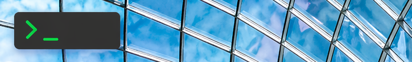
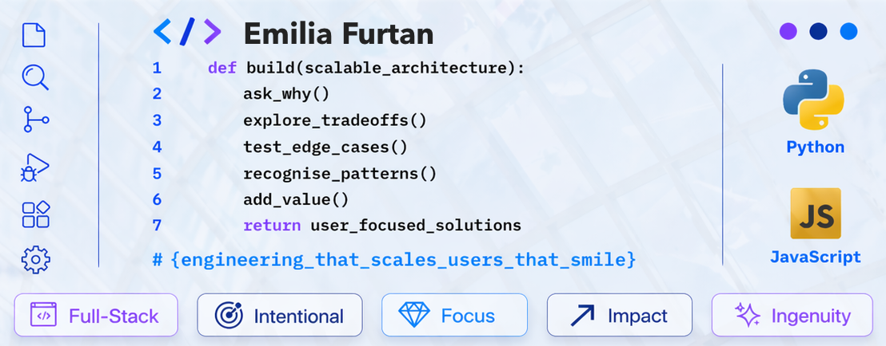
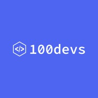
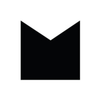

  
   
  

<h2 align="center">
  
 ✨ Hi there, I'm Emilia (Emilka) 
</h2>

🤝☕ Feel free to connect on LinkedIn — or book a 15–30 min Zoom chat via Calendly (Monday evenings, UK time) 
Open to opportunities in London and hybrid / remote work, or collaboration on interesting projects (UK / US / anywhere) 

📚 I learn by building — currently focused on full-stack projects (JavaScript / Python) and clean, tested code

🐬 Dolphin C.O.D.E. brain type - [Check yours here](https://mybrainanimal.com)

🏁✨ Software Engineer (100Devs, Makers Academy) with a background in Art & Design and Architecture & Town Planning (MSc)

Interests: technology, architecture, drawing & painting, graphics, photography, running 

 

<h2 align="center">
  🛠️✨ Tech Stack
</h2>  

Technologies I worked with at the 100Devs program and during Makers Academy’s 16-week full-time bootcamp

---

    <strong>
    
   100Devs — Full-stack JavaScript development
  </strong>

  &nbsp;
  &nbsp;
  

  
    JavaScript · React · Node.js · Express · HTML · CSS · Git · GitHub · VS Code · REST APIs · Data Structures & Algorithms
  

---

  <strong>
    
    Makers Academy — Full-stack JavaScript & Python development
  </strong>

<table align="center" width="960">
  <tr>
    <td align="center" valign="top" width="560">
      <strong>Frontend</strong>  
       
      JavaScript · React · Next.js · Vite · HTML · CSS · Tailwind CSS
    </td>
    <td align="center" valign="top" width="400">
      <strong>Backend</strong>  
      &nbsp;&nbsp; 
      Node.js · Express · Python · Flask · Kotlin
    </td>
  </tr>
  <tr>
    <td align="center" valign="top" width="560">
      <strong>Databases</strong>  
      &nbsp;&nbsp; 
      PostgreSQL · MongoDB · Mongoose · SQL
    </td>
    <td align="center" valign="top" width="400">
      <strong>Testing</strong>  
      &nbsp;&nbsp; 
      Jest · Pytest · Test-Driven Development
    </td>
  </tr>
  <tr>
    <td align="center" valign="top" width="560">
      <strong>Tools &amp; Workflow</strong>  
       
      Git · GitHub · VS Code · IntelliJ IDEA · Postman
    </td>
    <td align="center" valign="top" width="400">
      <strong>Engineering Foundations</strong>  
      Object-Oriented Programming (OOP) REST APIs Agile Delivery Pair Programming Debugging
    </td>
  </tr>
</table>

---

  <strong>Full-Stack Practice — Building Engineering Depth with JavaScript & Python</strong>

---

  Thank you for visiting my GitHub. Have a great day ☕ or night ✨

<!--
**EmilkaFn/EmilkaFn** is a ✨ _special_ ✨ repository because its `README.md` (this file) appears on your GitHub profile.

Here are some ideas to get you started:

- 🔭 I’m currently working on ...
- 🌱 I’m currently learning ...
- 👯 I’m looking to collaborate on ...
- 🤔 I’m looking for help with ...
- 💬 Ask me about ...
- 📫 How to reach me: ...
- 😄 Pronouns: ...
- ⚡ Fun fact: ...
-->
